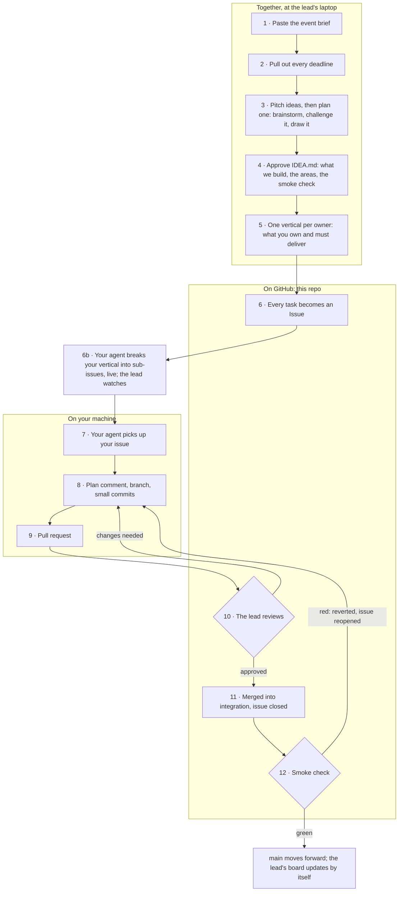
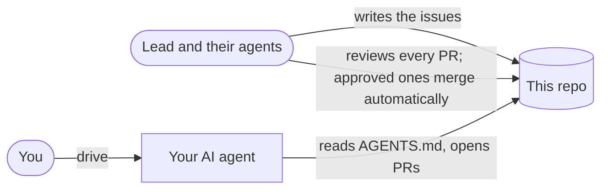
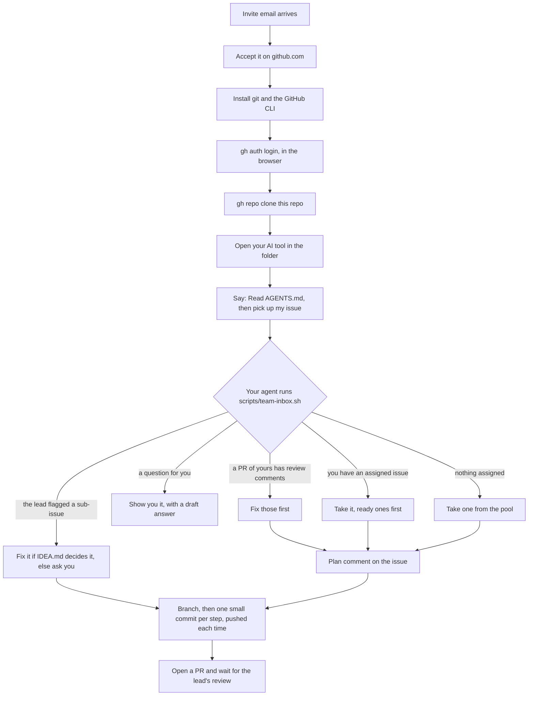
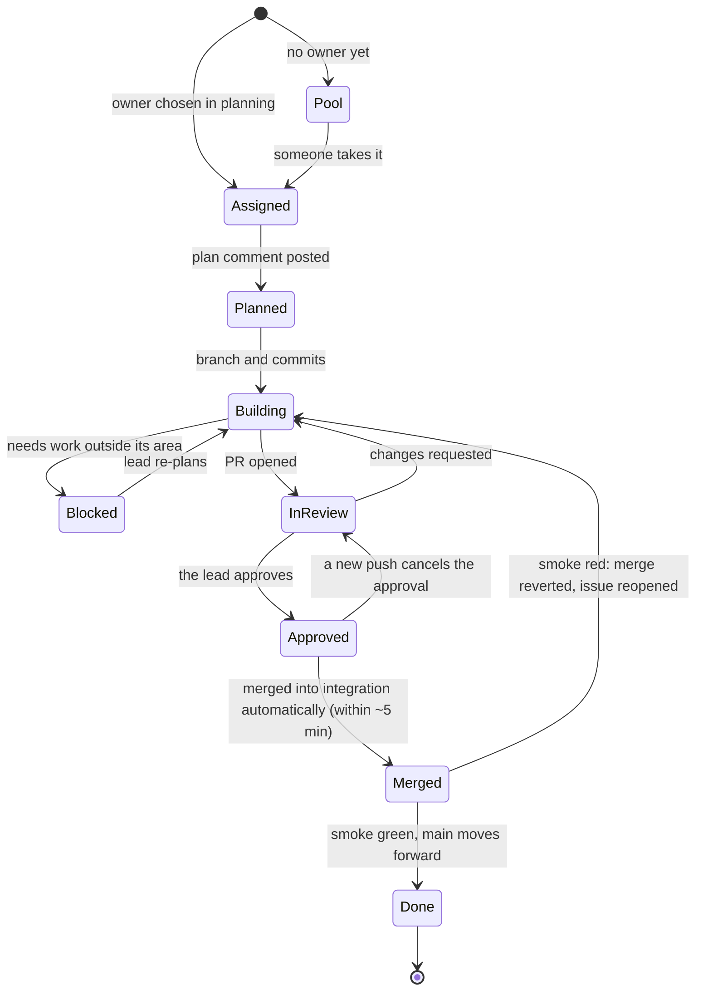
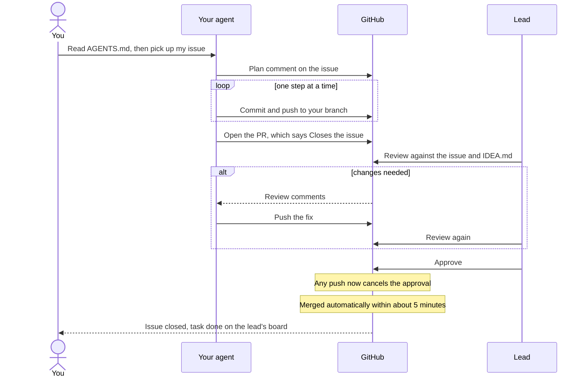

# Relay

Relay is an incident-response copilot: alerts come in, get clustered and scored, matched to runbooks, and an AI drafts a cited remediation plan that a human approves step by step. This repo is a walkthrough of the team board; no product code is being built here.

What we're building and who owns which part: [IDEA.md](IDEA.md). Deadlines, rules and
the team: [HACKATHON.md](HACKATHON.md). Who is doing what, live: the board linked in HACKATHON.md.

## Quick start

1. `gh repo clone atiladeokegab/relay-demo`
2. Open your AI tool (Claude Code, Codex, Cursor, Copilot…) in the folder.
3. Tell it: *"Read AGENTS.md, then pick up my issue."*

New to this? Read the rest of this page once. It takes ten minutes and saves hours.

## Before you start

- **git** and the **GitHub CLI 2.63 or newer** (`gh --version`), logged in with
  `gh auth login` in the browser. Don't use a fine-grained token (`github_pat_…`): it
  can't accept the invite or push to a repo you don't own.
- **Accept the invite** to this repo from your email or github.com/notifications. Until
  you do, your issues can't be assigned to you.
- **Never commit API keys.** This repo is public: keys go in `.env` (ignored), and are
  shared with the team outside GitHub.

---

## How this works

The lead plans the whole project first, on their own PC, usually with an AI planning agent.
Only then is the work split into small tasks, and each task becomes an Issue in this
repo. You and your AI agent pick up your issues one at a time. Nobody builds the whole
thing in one prompt.

## Who does what

| Who | Does | Never does |
|---|---|---|
| **Lead** | Agrees the idea, writes every issue, and reviews every PR, often through their own agents (named in [HACKATHON.md](HACKATHON.md)). An approved PR is merged automatically within about 5 minutes | Builds in a teammate's area |
| **You** | Own your area; tell your agent what to pick up; check its work | Merge; edit someone else's area |
| **Your agent** | Follows [AGENTS.md](AGENTS.md) to the letter | Merges; builds anything that has no issue |

## Your first hour

Your job while the agent works: read its plan comment before it starts, and glance at
each commit. If the plan looks wrong, say so on the issue. That is cheaper than a wrong PR.
Your agent will also bring you questions to approve: a teammate asking about your area, with a
draft answer. Edit or approve it; the asker is building on a guess until you do.

## Life of an issue

- **Pool** issues are unowned. Whoever finishes early takes one (AGENTS.md §3).
- **Blocked** means your agent opened a **change-request** instead of touching a file
  outside your area. The lead re-plans, the issue text changes, and you get a
  "Brief updated by the lead" comment.

## The PR and review loop

GitHub enforces the important part. Teammates can't push straight to `integration` or `main`;
only the lead's account can, which is how the lead moves `main` and reverts. A PR can't be
merged until the lead has approved it. A push after approval cancels the approval, so
what gets merged is exactly what was reviewed. Within about 5 minutes of the approval, the
lead's setup merges the PR into `integration` (one at a time, in dependency order), runs the smoke
check, and moves `main` only when it's green: `main` is always a working product. If the smoke
fails, your merge is reverted and your issue reopened with the failing output: fix it on the same
branch and open a new PR.

## The rules in one table

[AGENTS.md](AGENTS.md) is what your agent follows. This is the same thing, with the why.

| Rule | Why |
|---|---|
| Read `IDEA.md` and `HACKATHON.md` first | You build a part of one agreed idea, not your own version of it |
| Check the clock in UTC every session | After code freeze, no new features; after submit, nothing at all |
| Only work on issues | "Just build the whole frontend" is how five agents overwrite each other |
| Review fixes first, every session | A PR waiting on you blocks everyone who depends on it |
| One issue at a time | Small PRs get reviewed fast; big ones sit |
| Post a plan before the first commit | Mistakes are cheapest to catch before any code exists |
| One branch per issue (`gh issue develop 12 --checkout`) | Your work never lands on `integration` unreviewed |
| One small commit per step, pushed straight away | The lead can see progress, and nothing is lost if your laptop dies |
| Stay in your area | Two people editing one file lose each other's work |
| Anything bigger: open a change-request | The lead re-plans it for everyone, instead of it surprising someone later |
| Question outside your area: ask its owner, keep building on your guess | The expert answers in minutes; nobody sits blocked |
| Never edit an issue body; comment instead | The lead's board owns the text, and would overwrite your edit |
| PR from the template: plan link ticked, Impact, how you checked | The reviewer knows what to look at in one glance |
| Never merge; don't push after approval | Approved PRs merge automatically; a push after approval cancels the approval |
| Never commit secrets or agent files | The repo is public; a leaked key must be revoked, not just deleted |

## Troubleshooting

Every one of these happened for real while this kit was tested.

| You see | Why | Fix |
|---|---|---|
| `HTTP 403`, "Resource not accessible by personal access token", or "Permission … denied" on push | You logged in with a fine-grained token (`github_pat_…`) | `gh auth login` again, in the browser |
| `'you' not found` when your issue is assigned, or no issues assigned to you | You haven't accepted the repo invite yet | Accept it at github.com/notifications, then wait for the next sync (about 10 minutes) |
| `gh issue list --assignee @me` ignores the filter (PowerShell) | PowerShell reads `@me` as its own syntax | Quote it: `"@me"` |
| `fatal: Need to specify how to reconcile divergent branches` | Plain `git pull` refuses once your branch and `integration` have both moved | `git pull --no-rebase origin integration`, fix conflicts in your area, commit, push |
| `GraphQL: Projects (classic) is being deprecated` | `gh issue view` / `gh pr view` without `--json`, on gh older than 2.77 | Use the `--json` form from AGENTS.md, or update gh |
| `API rate limit exceeded` from `team-inbox.sh` | Checking far more often than every 5 minutes | Check after each push and every 5 minutes, not in a tight loop |
| `GH006: Protected branch update failed` | You pushed to `integration` or `main` | Push to your issue's branch and open a PR |
| "Waiting on code owner review" | The lead hasn't approved your PR yet (or a push cancelled the approval) | Nothing: wait for the lead's review |
| Your plan comment shows up garbled | Windows PowerShell's `>` wrote the file as UTF-16 | Write it with your editor, or `Set-Content -Encoding utf8` |
| The pool search comes back empty right after the lead adds work | GitHub's search index lags a few seconds | Wait a minute and search again |
| `gh issue develop` says the branch already exists | A second session on the same issue | `git fetch origin`, then `git branch -r --list "origin/12-*"`, then check that branch out |

## Glossary

| Word | Meaning here |
|---|---|
| **Issue** | One piece of work, a question, or a change-request. A task issue is written by the lead (or by you, in your own area): context, your area, the approach, how to check it, its deadline |
| **Pool** | Issues with no owner. Anyone who finishes early takes one |
| **Vertical** | Your whole part of the product: one issue saying which files you own and what you must deliver |
| **Sub-issue** | One task inside your vertical. Your agent writes them, live, under the vertical; anyone can see them change |
| **Mockup** | `docs/mockup/index.html`: the designer's clickable picture of every screen and state. The web page is built to look like it |
| **Branch** | Your own copy of the code for one issue. Named after it, like `12-add-login-form` |
| **Commit** | One saved step of work, with a message like `feat: login form (#12)` |
| **Push** | Sending your commits to GitHub so others can see them |
| **Pull request (PR)** | Asking for your branch to be merged into `integration` |
| **Review** | The lead reading your PR against the issue and `IDEA.md`, then approving it or asking for changes |
| **Merge** | Your branch joining `integration`. Happens automatically once the lead approves; never by you |
| **`integration`** | Where every merged PR lands. The default branch |
| **`main`** | The last version that passed the smoke check. Only the lead moves it |
| **CODEOWNERS** | The file that makes the lead's approval required on every PR |
| **Milestone** | A deadline on GitHub: each issue belongs to `code freeze` or `submit` |
| **Change-request** | An issue asking the lead to re-plan something outside your area |
| **Question** | An issue asking the owner of an area something; your agent keeps building on its guess meanwhile |
| **Code freeze** | The time after which only fixes, demo and submission work are allowed |

---

## Architecture

